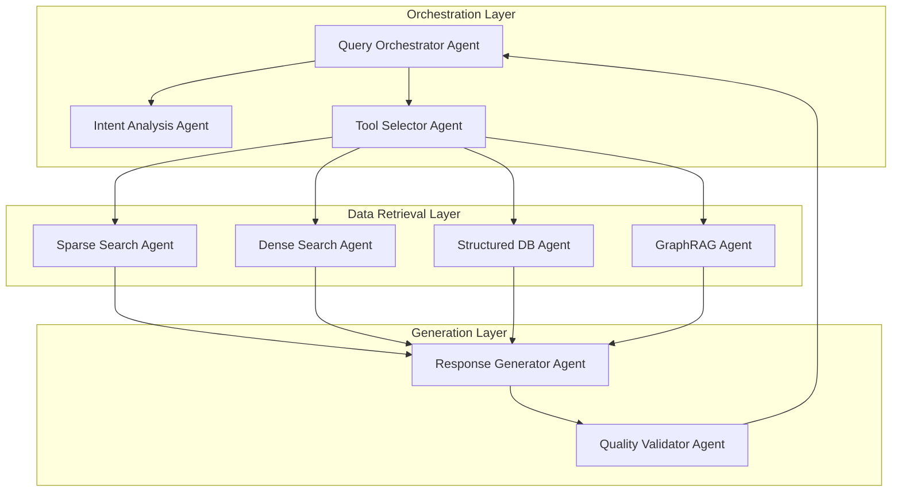
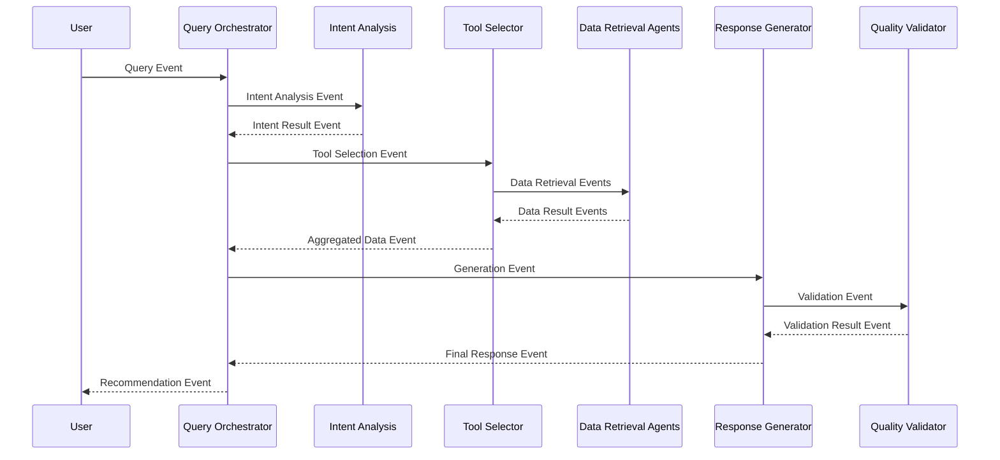

# 🎨🎨🎨 ENTERING CREATIVE PHASE: AGENT INTERACTION PATTERNS 🎨🎨🎨

## Context and Problem Statement

The financial product recommendation system requires sophisticated agent coordination where multiple specialized agents must work together to process user queries, analyze intent, retrieve relevant data from multiple sources, and generate personalized recommendations. The agents must communicate effectively while maintaining context and ensuring high-quality outputs.

### Agent Requirements
- Query Orchestrator: Coordinates the entire recommendation workflow
- Intent Analysis: Determines user intent and query classification
- Tool Selector: Chooses appropriate data sources and tools
- Data Retrieval Agents: Specialized agents for different data sources
- Response Generator: Creates final recommendations using Anthropic Claude
- Quality Validator: Ensures response quality and relevance

### Interaction Requirements
- Asynchronous communication via event bus
- Context preservation across agent interactions
- Error handling and retry mechanisms
- Performance optimization for real-time responses
- Audit trail for all agent decisions

## Agent Interaction Pattern Options Analysis

### Option 1: Hierarchical Orchestration Pattern

**Description**: Single master agent (Query Orchestrator) that directly controls and coordinates all other agents in a hierarchical structure.

**Pros**:
- Clear control flow and responsibility
- Easy to understand and debug
- Centralized decision making
- Simple error handling

**Cons**:
- Single point of failure
- Limited agent autonomy
- Potential bottlenecks
- Difficult to scale horizontally

**Technical Fit**: Medium
**Complexity**: Low
**Scalability**: Low

### Option 2: Event-Driven Peer-to-Peer Pattern

**Description**: All agents communicate through events, with each agent being autonomous and responding to relevant events.

**Pros**:
- High scalability and fault tolerance
- Agent autonomy and independence
- Easy to add new agents
- Natural fit for event-driven architecture

**Cons**:
- Complex coordination logic
- Potential for event storms
- Difficult to maintain conversation context
- Debugging complexity

**Technical Fit**: High
**Complexity**: High
**Scalability**: Very High

### Option 3: Hybrid Orchestration with Event Communication

**Description**: Hierarchical orchestration with event-driven communication between agents, combining the best of both approaches.

**Pros**:
- Clear orchestration with flexible communication
- Good scalability and fault tolerance
- Maintains conversation context
- Balanced complexity and performance

**Cons**:
- Moderate complexity in implementation
- Requires careful event schema design
- Potential for coordination overhead

**Technical Fit**: Very High
**Complexity**: Medium-High
**Scalability**: High

## Decision

**Chosen Option**: Option 3 - Hybrid Orchestration with Event Communication

**Rationale**:
1. **Optimal CrewAI Integration**: CrewAI naturally supports both orchestration and event-driven patterns, making this hybrid approach ideal.

2. **Financial Domain Requirements**: Financial recommendations require both structured coordination and flexible data source integration.

3. **Scalability and Reliability**: Combines the reliability of orchestration with the scalability of event-driven communication.

4. **Context Preservation**: Maintains conversation context while allowing for flexible agent interactions.

5. **Future Extensibility**: Easy to add new agents or modify existing ones without major architectural changes.

## Agent Interaction Design

### Agent Hierarchy and Responsibilities



### Event Communication Schema



## Agent Communication Protocols

### Event Types and Payloads

#### 1. Query Events
```json
{
  "event_type": "user_query",
  "session_id": "uuid",
  "user_id": "user_uuid",
  "query_text": "I need a low-risk investment option",
  "context": {
    "conversation_history": [...],
    "user_profile": {...},
    "preferences": {...}
  },
  "timestamp": "2024-01-01T00:00:00Z"
}
```

#### 2. Intent Analysis Events
```json
{
  "event_type": "intent_analysis_result",
  "session_id": "uuid",
  "intent": {
    "primary_intent": "investment_recommendation",
    "confidence": 0.95,
    "entities": {
      "risk_level": "low",
      "investment_type": "general"
    },
    "sub_intents": ["risk_assessment", "product_search"]
  },
  "timestamp": "2024-01-01T00:00:01Z"
}
```

#### 3. Tool Selection Events
```json
{
  "event_type": "tool_selection_result",
  "session_id": "uuid",
  "selected_tools": [
    {
      "tool_name": "structured_db_search",
      "priority": 1,
      "parameters": {
        "risk_level": "low",
        "product_category": "investment"
      }
    },
    {
      "tool_name": "vector_search",
      "priority": 2,
      "parameters": {
        "query": "low risk investment options",
        "limit": 10
      }
    }
  ],
  "timestamp": "2024-01-01T00:00:02Z"
}
```

#### 4. Data Retrieval Events
```json
{
  "event_type": "data_retrieval_result",
  "session_id": "uuid",
  "source": "structured_db_search",
  "results": [
    {
      "product_id": "prod_123",
      "name": "Conservative Growth Fund",
      "risk_level": "low",
      "expected_return": "3-5%",
      "confidence": 0.92
    }
  ],
  "metadata": {
    "query_time": "0.15s",
    "result_count": 5
  },
  "timestamp": "2024-01-01T00:00:03Z"
}
```

#### 5. Generation Events
```json
{
  "event_type": "response_generation_result",
  "session_id": "uuid",
  "response": {
    "recommendations": [...],
    "explanation": "Based on your low-risk preference...",
    "confidence": 0.88,
    "sources": ["structured_db", "vector_search"]
  },
  "metadata": {
    "generation_time": "1.2s",
    "model_used": "anthropic_claude"
  },
  "timestamp": "2024-01-01T00:00:04Z"
}
```

## Agent Implementation Patterns

### 1. Query Orchestrator Agent

**Role**: Master coordinator for the entire recommendation process
**Responsibilities**:
- Receive and validate user queries
- Coordinate agent interactions
- Maintain conversation context
- Handle errors and retries
- Deliver final responses

**Implementation**:
```python
class QueryOrchestratorAgent(Agent):
    def __init__(self):
        super().__init__(
            role="Query Orchestrator",
            goal="Coordinate the entire recommendation process",
            backstory="Master coordinator for financial product recommendations"
        )
    
    def process_query(self, query_event):
        # 1. Validate query
        # 2. Trigger intent analysis
        # 3. Coordinate tool selection
        # 4. Aggregate results
        # 5. Generate response
        # 6. Validate and deliver
```

### 2. Intent Analysis Agent

**Role**: Analyze user intent and extract entities
**Responsibilities**:
- Classify query intent
- Extract relevant entities
- Determine query complexity
- Identify user preferences

**Implementation**:
```python
class IntentAnalysisAgent(Agent):
    def __init__(self):
        super().__init__(
            role="Intent Analyzer",
            goal="Analyze user intent and extract entities",
            backstory="Specialized in understanding financial queries"
        )
    
    def analyze_intent(self, query_text, context):
        # Use Anthropic Claude for intent analysis
        # Return structured intent result
```

### 3. Tool Selector Agent

**Role**: Choose appropriate data sources and tools
**Responsibilities**:
- Select relevant data sources
- Prioritize search strategies
- Optimize for performance
- Handle fallback scenarios

**Implementation**:
```python
class ToolSelectorAgent(Agent):
    def __init__(self):
        super().__init__(
            role="Tool Selector",
            goal="Choose optimal data sources and tools",
            backstory="Expert in data source selection and optimization"
        )
    
    def select_tools(self, intent, context):
        # Analyze intent and select appropriate tools
        # Return prioritized tool list
```

### 4. Data Retrieval Agents

**Role**: Specialized agents for different data sources
**Responsibilities**:
- Execute specific search strategies
- Format results consistently
- Handle source-specific errors
- Optimize for performance

**Implementation**:
```python
class SparseSearchAgent(Agent):
    def __init__(self):
        super().__init__(
            role="Sparse Search Specialist",
            goal="Execute keyword-based searches",
            backstory="Expert in BM25 and keyword search"
        )
    
    def search(self, query, parameters):
        # Execute BM25 search
        # Return formatted results
```

### 5. Response Generator Agent

**Role**: Generate final recommendations using Anthropic Claude
**Responsibilities**:
- Combine data from multiple sources
- Generate personalized recommendations
- Ensure response quality
- Format for user consumption

**Implementation**:
```python
class ResponseGeneratorAgent(Agent):
    def __init__(self):
        super().__init__(
            role="Response Generator",
            goal="Generate personalized recommendations",
            backstory="Expert in financial product recommendations"
        )
    
    def generate_response(self, aggregated_data, context):
        # Use Anthropic Claude for generation
        # Return structured recommendation
```

## Error Handling and Recovery

### Circuit Breaker Pattern
- Implement circuit breakers for external service calls
- Automatic fallback to alternative data sources
- Graceful degradation for non-critical components

### Retry Mechanisms
- Exponential backoff for transient failures
- Maximum retry limits to prevent infinite loops
- Different retry strategies for different failure types

### Error Event Schema
```json
{
  "event_type": "error",
  "session_id": "uuid",
  "error": {
    "type": "data_source_unavailable",
    "message": "ChromaDB connection failed",
    "severity": "medium",
    "fallback_used": "structured_db_only"
  },
  "timestamp": "2024-01-01T00:00:05Z"
}
```

## Performance Optimization

### Caching Strategy
- Cache intent analysis results for similar queries
- Cache tool selection decisions
- Cache frequently accessed data

### Parallel Processing
- Execute multiple data retrieval operations in parallel
- Use async/await patterns for non-blocking operations
- Implement connection pooling for database operations

### Load Balancing
- Distribute agent instances across multiple servers
- Implement health checks and auto-scaling
- Use message queue for load distribution

## Monitoring and Observability

### Agent Metrics
- Response times for each agent
- Success/failure rates
- Resource utilization
- Decision quality metrics

### Event Tracing
- Distributed tracing across all agents
- Correlation IDs for request tracking
- Performance profiling for optimization

### Alerting
- Error rate thresholds
- Performance degradation alerts
- Agent health monitoring

🎨 CREATIVE CHECKPOINT: Agent Interaction Patterns Complete

## Validation

### Requirements Met
- ✅ Asynchronous communication via event bus
- ✅ Context preservation across agent interactions
- ✅ Error handling and retry mechanisms
- ✅ Performance optimization for real-time responses
- ✅ Audit trail for all agent decisions
- ✅ Scalable and fault-tolerant design

### Technical Feasibility
- CrewAI provides excellent support for the hybrid orchestration pattern
- Event-driven communication is well-supported by modern message queues
- Anthropic Claude integration is straightforward with CrewAI
- All components are proven technologies

### Risk Assessment
- **Low Risk**: Core agent patterns are well-established
- **Medium Risk**: Event complexity requires careful testing
- **Mitigated Risk**: Comprehensive monitoring and error handling

🎨🎨🎨 EXITING CREATIVE PHASE - AGENT INTERACTION PATTERNS DECISION MADE 🎨🎨🎨 