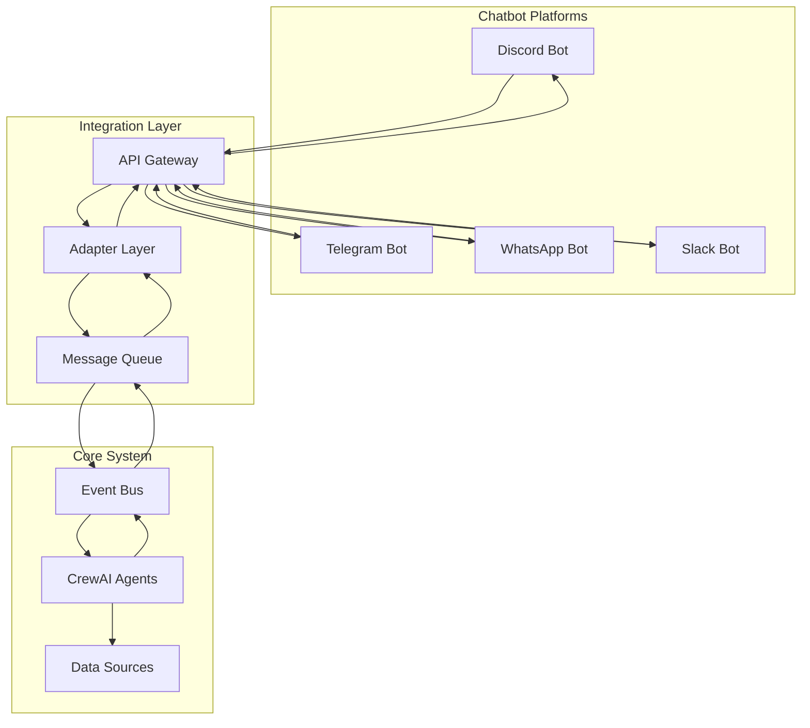
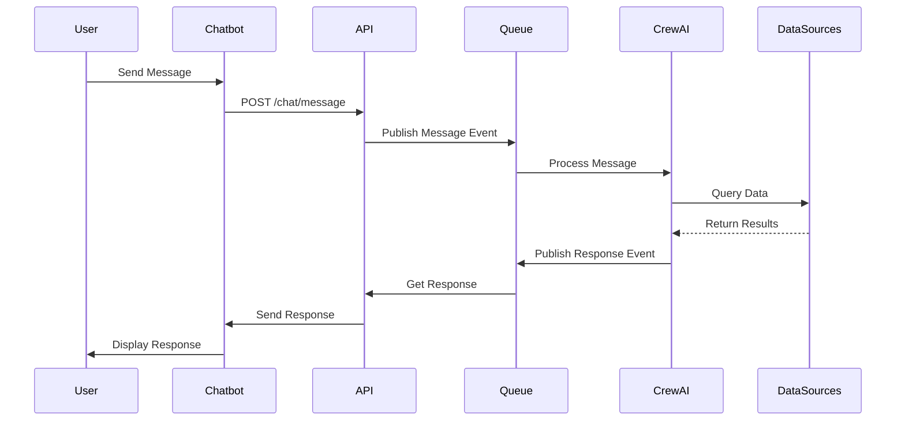

# 🎨🎨🎨 ENTERING CREATIVE PHASE: INTEGRATION STRATEGY DESIGN 🎨🎨🎨

## Context and Problem Statement

The financial product recommendation system needs a robust integration strategy that connects the CrewAI agent system with external chatbot platforms (Discord, Telegram, etc.) and various data sources. The integration must handle real-time message processing, maintain conversation context, and provide seamless user experience while ensuring security and compliance for financial data.

### Integration Requirements
- Chatbot platform integration (Discord/Telegram/WhatsApp)
- Real-time message processing and response delivery
- API-first architecture for multiple client types
- Secure data handling and user authentication
- Conversation context management across sessions
- Error handling and fallback mechanisms

### Technical Constraints
- CrewAI agent system as core processing engine
- Event-driven architecture for scalability
- Anthropic Claude as primary LLM
- Multiple data source integration
- Financial compliance requirements

## Integration Strategy Options Analysis

### Option 1: Direct Chatbot Integration with Webhook Architecture

**Description**: Direct integration with chatbot platforms using webhooks, with the CrewAI system processing messages directly.

**Pros**:
- Simple architecture with minimal layers
- Direct message processing
- Lower latency for responses
- Easier debugging and monitoring

**Cons**:
- Platform-specific implementations required
- Limited flexibility for multiple platforms
- Tight coupling with chatbot platforms
- Difficult to scale across multiple platforms

**Technical Fit**: Medium
**Complexity**: Low
**Scalability**: Low

### Option 2: API Gateway with Universal Chatbot Adapter

**Description**: Centralized API gateway that abstracts chatbot platform differences, with universal adapters for each platform.

**Pros**:
- Platform-agnostic design
- Easy to add new chatbot platforms
- Centralized message processing
- Better scalability and maintainability

**Cons**:
- Additional complexity with adapter layer
- Potential latency overhead
- More complex error handling
- Requires careful adapter design

**Technical Fit**: High
**Complexity**: Medium
**Scalability**: High

### Option 3: Event-Driven Integration with Message Queue

**Description**: Event-driven integration using message queues, with chatbot platforms as event producers and the CrewAI system as consumers.

**Pros**:
- Excellent scalability and fault tolerance
- Natural fit with event-driven architecture
- Easy to add new platforms and features
- Robust error handling and retry mechanisms

**Cons**:
- Higher complexity in implementation
- Potential message ordering issues
- More complex monitoring and debugging
- Requires careful event schema design

**Technical Fit**: Very High
**Complexity**: High
**Scalability**: Very High

## Decision

**Chosen Option**: Option 3 - Event-Driven Integration with Message Queue

**Rationale**:
1. **Perfect Architecture Alignment**: Matches the chosen event-driven architecture, providing seamless integration with the existing system design.

2. **Scalability for Multiple Platforms**: Can easily support Discord, Telegram, WhatsApp, and other platforms without major architectural changes.

3. **Robust Error Handling**: Message queues provide built-in retry mechanisms and fault tolerance for reliable message processing.

4. **Future Extensibility**: Easy to add new chatbot platforms, features, or processing steps without disrupting existing functionality.

5. **Performance Optimization**: Allows for asynchronous processing and load balancing across multiple instances.

## Integration Architecture Design

### Chatbot Platform Integration Layer



### Message Flow Architecture



## API Design Strategy

### 1. RESTful API Endpoints

```python
from fastapi import FastAPI, HTTPException, Depends
from pydantic import BaseModel
from typing import Optional, Dict, Any

class ChatMessage(BaseModel):
    """Incoming chat message"""
    platform: str = Field(description="Chat platform (discord, telegram, etc.)")
    user_id: str = Field(description="User identifier")
    session_id: str = Field(description="Session identifier")
    message_text: str = Field(description="Message content")
    timestamp: datetime = Field(description="Message timestamp")
    metadata: Optional[Dict[str, Any]] = Field(description="Platform-specific metadata")

class ChatResponse(BaseModel):
    """Chat response"""
    response_text: str = Field(description="Response content")
    recommendations: Optional[List[Dict[str, Any]]] = Field(description="Product recommendations")
    confidence: float = Field(description="Response confidence score")
    sources: List[str] = Field(description="Data sources used")
    processing_time: float = Field(description="Processing time in seconds")

# API Endpoints
@app.post("/chat/message", response_model=ChatResponse)
async def process_chat_message(message: ChatMessage):
    """Process incoming chat message"""
    try:
        # Publish message event
        event = ChatMessageEvent(
            platform=message.platform,
            user_id=message.user_id,
            session_id=message.session_id,
            message_text=message.message_text,
            timestamp=message.timestamp,
            metadata=message.metadata
        )
        await event_bus.publish("chat.message", event)
        
        # Wait for response (with timeout)
        response = await wait_for_response(message.session_id, timeout=30.0)
        return response
    except Exception as e:
        raise HTTPException(status_code=500, detail=str(e))

@app.get("/chat/session/{session_id}")
async def get_session_info(session_id: str):
    """Get conversation session information"""
    session = await session_manager.get_session(session_id)
    return session

@app.post("/chat/session/{session_id}/reset")
async def reset_session(session_id: str):
    """Reset conversation session"""
    await session_manager.reset_session(session_id)
    return {"status": "success"}
```

### 2. WebSocket Support for Real-time Communication

```python
@app.websocket("/chat/ws/{session_id}")
async def websocket_endpoint(websocket: WebSocket, session_id: str):
    """WebSocket endpoint for real-time chat"""
    await websocket.accept()
    
    try:
        while True:
            # Receive message from client
            data = await websocket.receive_text()
            message = ChatMessage.parse_raw(data)
            
            # Process message asynchronously
            response = await process_message_async(message)
            
            # Send response back
            await websocket.send_text(response.json())
    except WebSocketDisconnect:
        await session_manager.close_session(session_id)
```

## Chatbot Platform Adapters

### 1. Discord Bot Adapter

```python
import discord
from discord.ext import commands

class DiscordBotAdapter:
    """Discord bot adapter for financial recommendations"""
    
    def __init__(self, token: str, api_client):
        self.bot = commands.Bot(command_prefix='!')
        self.api_client = api_client
        self.setup_commands()
    
    def setup_commands(self):
        @self.bot.command(name='recommend')
        async def recommend(ctx, *, query: str):
            """Get financial product recommendations"""
            try:
                # Create chat message
                message = ChatMessage(
                    platform="discord",
                    user_id=str(ctx.author.id),
                    session_id=f"discord_{ctx.channel.id}",
                    message_text=query,
                    timestamp=datetime.utcnow(),
                    metadata={
                        "channel_id": str(ctx.channel.id),
                        "guild_id": str(ctx.guild.id) if ctx.guild else None
                    }
                )
                
                # Process through API
                response = await self.api_client.process_message(message)
                
                # Send response
                embed = discord.Embed(
                    title="Financial Recommendation",
                    description=response.response_text,
                    color=0x00ff00
                )
                
                if response.recommendations:
                    for rec in response.recommendations[:3]:
                        embed.add_field(
                            name=rec["name"],
                            value=f"Risk: {rec['risk_level']} | Return: {rec['expected_return']}",
                            inline=False
                        )
                
                await ctx.send(embed=embed)
                
            except Exception as e:
                await ctx.send(f"Sorry, I encountered an error: {str(e)}")
    
    async def start(self):
        """Start the Discord bot"""
        await self.bot.start(self.token)
```

### 2. Telegram Bot Adapter

```python
from telegram import Update
from telegram.ext import Application, CommandHandler, MessageHandler, filters

class TelegramBotAdapter:
    """Telegram bot adapter for financial recommendations"""
    
    def __init__(self, token: str, api_client):
        self.application = Application.builder().token(token).build()
        self.api_client = api_client
        self.setup_handlers()
    
    def setup_handlers(self):
        async def start_command(update: Update, context):
            """Handle /start command"""
            await update.message.reply_text(
                "Hello! I'm your financial product recommendation assistant. "
                "Ask me about investment options, risk levels, or specific products."
            )
        
        async def recommend_command(update: Update, context):
            """Handle /recommend command"""
            query = " ".join(context.args) if context.args else "general investment options"
            await self.process_recommendation(update, query)
        
        async def message_handler(update: Update, context):
            """Handle regular messages"""
            query = update.message.text
            await self.process_recommendation(update, query)
        
        self.application.add_handler(CommandHandler("start", start_command))
        self.application.add_handler(CommandHandler("recommend", recommend_command))
        self.application.add_handler(MessageHandler(filters.TEXT & ~filters.COMMAND, message_handler))
    
    async def process_recommendation(self, update: Update, query: str):
        """Process recommendation request"""
        try:
            message = ChatMessage(
                platform="telegram",
                user_id=str(update.effective_user.id),
                session_id=f"telegram_{update.effective_chat.id}",
                message_text=query,
                timestamp=datetime.utcnow(),
                metadata={
                    "chat_id": str(update.effective_chat.id),
                    "username": update.effective_user.username
                }
            )
            
            response = await self.api_client.process_message(message)
            
            # Format response for Telegram
            response_text = f"💡 **Recommendation**\n\n{response.response_text}"
            
            if response.recommendations:
                response_text += "\n\n📊 **Top Recommendations:**\n"
                for i, rec in enumerate(response.recommendations[:3], 1):
                    response_text += f"{i}. **{rec['name']}**\n"
                    response_text += f"   Risk: {rec['risk_level']} | Return: {rec['expected_return']}\n\n"
            
            await update.message.reply_text(response_text, parse_mode='Markdown')
            
        except Exception as e:
            await update.message.reply_text(f"Sorry, I encountered an error: {str(e)}")
    
    async def start(self):
        """Start the Telegram bot"""
        await self.application.run_polling()
```

## Event Schema for Integration

### 1. Chat Message Events

```python
class ChatMessageEvent(BaseModel):
    """Event for incoming chat messages"""
    event_type: str = Field(default="chat.message")
    platform: str = Field(description="Chat platform")
    user_id: str = Field(description="User identifier")
    session_id: str = Field(description="Session identifier")
    message_text: str = Field(description="Message content")
    timestamp: datetime = Field(description="Event timestamp")
    metadata: Dict[str, Any] = Field(description="Platform-specific metadata")

class ChatResponseEvent(BaseModel):
    """Event for chat responses"""
    event_type: str = Field(default="chat.response")
    session_id: str = Field(description="Session identifier")
    response_text: str = Field(description="Response content")
    recommendations: List[Dict[str, Any]] = Field(description="Product recommendations")
    confidence: float = Field(description="Response confidence")
    sources: List[str] = Field(description="Data sources used")
    processing_time: float = Field(description="Processing time")
    timestamp: datetime = Field(description="Event timestamp")
```

### 2. Session Management Events

```python
class SessionCreatedEvent(BaseModel):
    """Event for session creation"""
    event_type: str = Field(default="session.created")
    session_id: str = Field(description="Session identifier")
    user_id: str = Field(description="User identifier")
    platform: str = Field(description="Chat platform")
    timestamp: datetime = Field(description="Event timestamp")

class SessionEndedEvent(BaseModel):
    """Event for session ending"""
    event_type: str = Field(default="session.ended")
    session_id: str = Field(description="Session identifier")
    duration: float = Field(description="Session duration in seconds")
    message_count: int = Field(description="Total messages in session")
    timestamp: datetime = Field(description="Event timestamp")
```

## Error Handling and Fallback Strategies

### 1. Circuit Breaker Pattern

```python
class ChatbotCircuitBreaker:
    """Circuit breaker for chatbot platform integrations"""
    
    def __init__(self, failure_threshold: int = 5, timeout: int = 60):
        self.failure_threshold = failure_threshold
        self.timeout = timeout
        self.failure_count = 0
        self.last_failure_time = None
        self.state = "CLOSED"  # CLOSED, OPEN, HALF_OPEN
    
    async def call(self, func, *args, **kwargs):
        """Execute function with circuit breaker protection"""
        if self.state == "OPEN":
            if time.time() - self.last_failure_time > self.timeout:
                self.state = "HALF_OPEN"
            else:
                raise Exception("Circuit breaker is OPEN")
        
        try:
            result = await func(*args, **kwargs)
            if self.state == "HALF_OPEN":
                self.state = "CLOSED"
                self.failure_count = 0
            return result
        except Exception as e:
            self.failure_count += 1
            self.last_failure_time = time.time()
            
            if self.failure_count >= self.failure_threshold:
                self.state = "OPEN"
            
            raise e
```

### 2. Fallback Response System

```python
class FallbackResponseSystem:
    """Fallback system for when primary systems fail"""
    
    def __init__(self):
        self.fallback_responses = {
            "general_error": "I'm having trouble processing your request right now. Please try again in a moment.",
            "data_unavailable": "I'm unable to access the product database at the moment. Please try again later.",
            "llm_unavailable": "I'm experiencing technical difficulties. Please try again in a few minutes.",
            "timeout": "Your request is taking longer than expected. Please try again."
        }
    
    def get_fallback_response(self, error_type: str, user_query: str) -> str:
        """Get appropriate fallback response"""
        base_response = self.fallback_responses.get(error_type, self.fallback_responses["general_error"])
        
        # Add some context based on the user query
        if "investment" in user_query.lower():
            base_response += " For investment advice, you may want to consult with a financial advisor."
        elif "risk" in user_query.lower():
            base_response += " Risk assessment requires current market data which is temporarily unavailable."
        
        return base_response
```

## Security and Compliance Integration

### 1. User Authentication and Authorization

```python
class ChatbotSecurityManager:
    """Security manager for chatbot integrations"""
    
    def __init__(self):
        self.allowed_platforms = ["discord", "telegram", "whatsapp", "slack"]
        self.rate_limit_window = 60  # seconds
        self.rate_limit_max = 10  # messages per window
    
    async def validate_request(self, message: ChatMessage) -> bool:
        """Validate incoming chat message"""
        # Validate platform
        if message.platform not in self.allowed_platforms:
            return False
        
        # Check rate limiting
        if not await self.check_rate_limit(message.user_id):
            return False
        
        # Validate message content
        if not self.validate_message_content(message.message_text):
            return False
        
        return True
    
    async def check_rate_limit(self, user_id: str) -> bool:
        """Check rate limiting for user"""
        current_time = time.time()
        user_requests = await self.get_user_requests(user_id)
        
        # Remove old requests
        recent_requests = [req for req in user_requests if current_time - req < self.rate_limit_window]
        
        if len(recent_requests) >= self.rate_limit_max:
            return False
        
        # Add current request
        await self.add_user_request(user_id, current_time)
        return True
    
    def validate_message_content(self, content: str) -> bool:
        """Validate message content for security"""
        # Check for potentially harmful content
        harmful_patterns = [
            r"<script.*?>",
            r"javascript:",
            r"on\w+\s*=",
        ]
        
        for pattern in harmful_patterns:
            if re.search(pattern, content, re.IGNORECASE):
                return False
        
        return True
```

### 2. Data Privacy and Compliance

```python
class ComplianceManager:
    """Compliance manager for financial data handling"""
    
    def __init__(self):
        self.required_disclaimers = {
            "investment_advice": "This is for informational purposes only and does not constitute investment advice.",
            "risk_disclosure": "All investments carry risk. Past performance does not guarantee future results.",
            "regulatory_notice": "Investment recommendations should be considered in consultation with a qualified financial advisor."
        }
    
    def add_compliance_disclaimers(self, response: ChatResponse) -> ChatResponse:
        """Add required compliance disclaimers to response"""
        disclaimers = []
        
        # Add general investment disclaimer
        disclaimers.append(self.required_disclaimers["investment_advice"])
        
        # Add risk disclosure if recommendations are provided
        if response.recommendations:
            disclaimers.append(self.required_disclaimers["risk_disclosure"])
        
        # Add regulatory notice
        disclaimers.append(self.required_disclaimers["regulatory_notice"])
        
        # Append disclaimers to response
        disclaimer_text = "\n\n" + "\n".join(disclaimers)
        response.response_text += disclaimer_text
        
        return response
```

## Performance Optimization

### 1. Message Queue Optimization

```python
class MessageQueueOptimizer:
    """Optimize message queue performance"""
    
    def __init__(self, queue_client):
        self.queue = queue_client
        self.batch_size = 10
        self.batch_timeout = 1.0  # seconds
    
    async def batch_process_messages(self, messages: List[ChatMessage]) -> List[ChatResponse]:
        """Process messages in batches for better performance"""
        batches = [messages[i:i + self.batch_size] for i in range(0, len(messages), self.batch_size)]
        results = []
        
        for batch in batches:
            # Process batch in parallel
            batch_tasks = [self.process_single_message(msg) for msg in batch]
            batch_results = await asyncio.gather(*batch_tasks, return_exceptions=True)
            
            # Filter out exceptions and add successful results
            for result in batch_results:
                if not isinstance(result, Exception):
                    results.append(result)
        
        return results
```

### 2. Caching Strategy

```python
class ChatbotCache:
    """Caching for chatbot responses"""
    
    def __init__(self, redis_client):
        self.redis = redis_client
        self.cache_ttl = 300  # 5 minutes
    
    async def get_cached_response(self, query_hash: str) -> Optional[ChatResponse]:
        """Get cached response for similar query"""
        key = f"chat_response:{query_hash}"
        cached_data = await self.redis.get(key)
        
        if cached_data:
            return ChatResponse.parse_raw(cached_data)
        return None
    
    async def cache_response(self, query_hash: str, response: ChatResponse):
        """Cache response for future use"""
        key = f"chat_response:{query_hash}"
        await self.redis.setex(key, self.cache_ttl, response.json())
```

🎨 CREATIVE CHECKPOINT: Integration Strategy Design Complete

## Validation

### Requirements Met
- ✅ Chatbot platform integration strategy
- ✅ Real-time message processing design
- ✅ API-first architecture
- ✅ Secure data handling and authentication
- ✅ Conversation context management
- ✅ Error handling and fallback mechanisms
- ✅ Performance optimization strategies

### Technical Feasibility
- Event-driven integration aligns with chosen architecture
- Chatbot adapters are well-established patterns
- Message queues provide reliable communication
- Security and compliance measures are comprehensive

### Risk Assessment
- **Low Risk**: Core integration patterns are proven
- **Medium Risk**: Multi-platform support requires careful testing
- **Mitigated Risk**: Comprehensive error handling and fallback systems

🎨🎨🎨 EXITING CREATIVE PHASE - INTEGRATION STRATEGY DESIGN DECISION MADE 🎨🎨🎨 