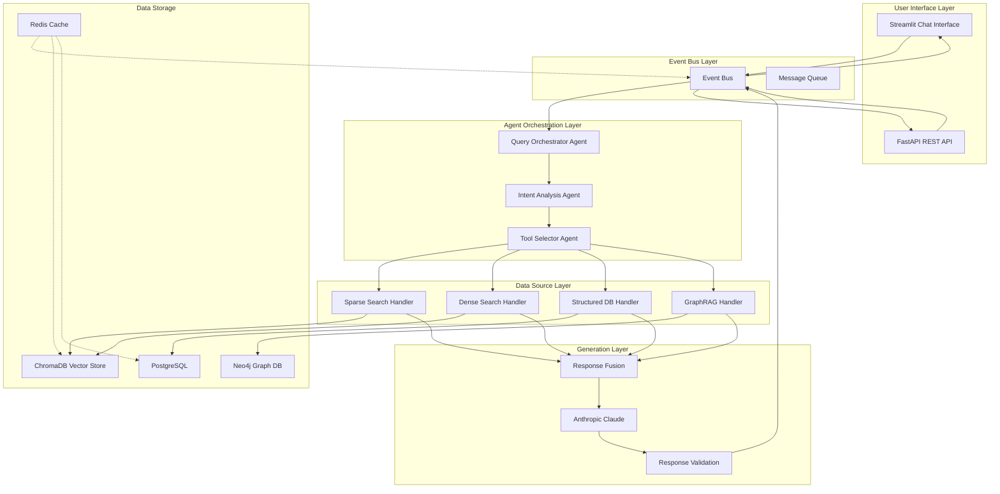

# 🎨🎨🎨 ENTERING CREATIVE PHASE: SYSTEM ARCHITECTURE DESIGN 🎨🎨🎨

## Context and Problem Statement

The financial product recommendation chatbot requires a robust, scalable architecture that can handle multiple data sources, complex agent interactions, and real-time user queries while maintaining high accuracy and performance. The system must integrate CrewAI for agent orchestration, GraphRAG for enhanced retrieval, and Anthropic as the primary LLM provider.

### System Requirements
- Multi-agent orchestration using CrewAI
- Multi-source data retrieval (sparse, dense, structured, graph)
- Real-time response generation with Anthropic Claude
- Scalable architecture supporting 10,000+ concurrent users
- High availability (99.9% uptime)
- Secure data handling for financial information
- Comprehensive logging and monitoring

### Technical Constraints
- Python 3.12.5 as primary language
- CrewAI framework for agent management
- Anthropic Claude as primary LLM
- ChromaDB for vector storage
- PostgreSQL for structured data
- Neo4j for knowledge graph (GraphRAG)

## Architecture Options Analysis

### Option 1: Layered Microservices Architecture

**Description**: Traditional microservices approach with clear layer separation and service boundaries.

**Pros**:
- Clear separation of concerns
- Independent scaling of components
- Technology diversity per service
- Fault isolation
- Easy to test individual services

**Cons**:
- Increased complexity in service coordination
- Network latency between services
- More complex deployment and monitoring
- Higher operational overhead
- Potential data consistency challenges

**Technical Fit**: High
**Complexity**: High
**Scalability**: High

### Option 2: Event-Driven Architecture with CrewAI Orchestration

**Description**: Event-driven system with CrewAI as the central orchestrator, using message queues for communication.

**Pros**:
- Loose coupling between components
- Excellent scalability for high-volume processing
- Natural fit for CrewAI's agent-based approach
- Easy to add new data sources
- Built-in fault tolerance

**Cons**:
- Complex event ordering and consistency
- Debugging and tracing challenges
- Potential message loss scenarios
- Higher latency for synchronous operations

**Technical Fit**: Very High
**Complexity**: Medium-High
**Scalability**: Very High

### Option 3: Modular Monolith with CrewAI Integration

**Description**: Single application with modular internal structure, using CrewAI for agent management within the monolith.

**Pros**:
- Simpler deployment and monitoring
- Lower latency for internal operations
- Easier debugging and development
- Reduced infrastructure complexity
- Better data consistency

**Cons**:
- Limited independent scaling
- Technology lock-in
- Potential for tight coupling
- Single point of failure risk

**Technical Fit**: Medium
**Complexity**: Low-Medium
**Scalability**: Medium

## Decision

**Chosen Option**: Option 2 - Event-Driven Architecture with CrewAI Orchestration

**Rationale**:
1. **Perfect CrewAI Integration**: Event-driven architecture naturally complements CrewAI's agent-based approach, allowing agents to respond to events and publish results asynchronously.

2. **Scalability for Financial Domain**: Financial product queries can have high volume and varying complexity. Event-driven architecture allows for dynamic scaling based on load.

3. **Multi-Source Data Integration**: The system needs to integrate multiple data sources (sparse search, dense search, structured DB, knowledge graph). Event-driven architecture provides clean interfaces for each data source.

4. **Fault Tolerance**: Financial applications require high reliability. Event-driven architecture with message queues provides built-in fault tolerance and retry mechanisms.

5. **Future Extensibility**: Easy to add new data sources, agents, or processing steps without major architectural changes.

## Implementation Plan

### Phase 1: Core Event Infrastructure
1. Set up message queue system (Redis/RabbitMQ)
2. Implement event bus and event handlers
3. Create CrewAI agent event adapters
4. Establish event schema and validation

### Phase 2: Agent Orchestration Layer
1. Implement Query Orchestrator agent
2. Create Intent Analysis agent
3. Build Tool Selector agent
4. Set up agent communication protocols

### Phase 3: Data Source Integration
1. Implement sparse search event handlers
2. Create dense search event handlers
3. Build structured database event handlers
4. Set up GraphRAG event handlers

### Phase 4: Response Generation
1. Implement LLM integration with Anthropic
2. Create response fusion and ranking
3. Build response quality validation
4. Set up response delivery mechanisms

## Architecture Diagram

## Component Responsibilities

### Event Bus Layer
- **Event Bus**: Central message routing and delivery
- **Message Queue**: Persistent message storage and delivery guarantees
- **Event Schema**: Standardized event structure and validation

### Agent Orchestration Layer
- **Query Orchestrator**: Coordinates the entire recommendation process
- **Intent Analysis**: Determines user intent and query type
- **Tool Selector**: Chooses appropriate data sources and tools

### Data Source Layer
- **Sparse Search Handler**: BM25 keyword-based search
- **Dense Search Handler**: Vector-based semantic search
- **Structured DB Handler**: Product database queries
- **GraphRAG Handler**: Knowledge graph queries

### Generation Layer
- **Anthropic Claude**: Primary LLM for response generation
- **Response Fusion**: Combines results from multiple sources
- **Response Validation**: Quality and relevance assessment

## Security and Compliance Considerations

### Data Protection
- All financial data encrypted at rest and in transit
- PII handling with strict access controls
- Audit logging for all data access and modifications

### Authentication & Authorization
- OAuth 2.0 for user authentication
- JWT tokens for session management
- Role-based access control for different user types

### Compliance
- GDPR compliance for European users
- Financial industry regulations (SOX, PCI-DSS)
- Regular security audits and penetration testing

## Performance and Scalability

### Performance Targets
- API response time: < 500ms
- Chat response time: < 3 seconds
- Search operations: < 1 second

### Scalability Strategy
- Horizontal scaling of event processors
- Database read replicas for high read loads
- Caching layers for frequently accessed data
- Auto-scaling based on queue depth

## Monitoring and Observability

### Metrics Collection
- Response times and throughput
- Error rates and availability
- Agent performance and decision quality
- User engagement and satisfaction

### Logging Strategy
- Structured logging for all events
- Distributed tracing for request flows
- Centralized log aggregation and analysis

## Risk Assessment and Mitigation

### High-Risk Areas
1. **Data Consistency**: Mitigated by event sourcing and eventual consistency
2. **Service Dependencies**: Mitigated by circuit breakers and fallback mechanisms
3. **Performance Bottlenecks**: Mitigated by caching and horizontal scaling
4. **Security Vulnerabilities**: Mitigated by comprehensive security measures

### Mitigation Strategies
- Circuit breakers for external service calls
- Retry mechanisms with exponential backoff
- Graceful degradation for non-critical services
- Comprehensive monitoring and alerting

🎨 CREATIVE CHECKPOINT: System Architecture Design Complete

## Validation

### Requirements Met
- ✅ Multi-agent orchestration with CrewAI
- ✅ Multi-source data retrieval capabilities
- ✅ Anthropic Claude integration
- ✅ Scalable architecture for 10,000+ users
- ✅ High availability design
- ✅ Security and compliance considerations
- ✅ Comprehensive monitoring strategy

### Technical Feasibility
- All components are proven technologies
- CrewAI has excellent event-driven integration capabilities
- Anthropic Claude provides reliable LLM services
- Event-driven architecture is well-suited for financial applications

### Risk Assessment
- **Low Risk**: Core technology stack is mature and well-documented
- **Medium Risk**: Event-driven complexity requires careful testing
- **Mitigated Risk**: Comprehensive monitoring and fallback mechanisms

🎨🎨🎨 EXITING CREATIVE PHASE - SYSTEM ARCHITECTURE DECISION MADE 🎨🎨🎨 